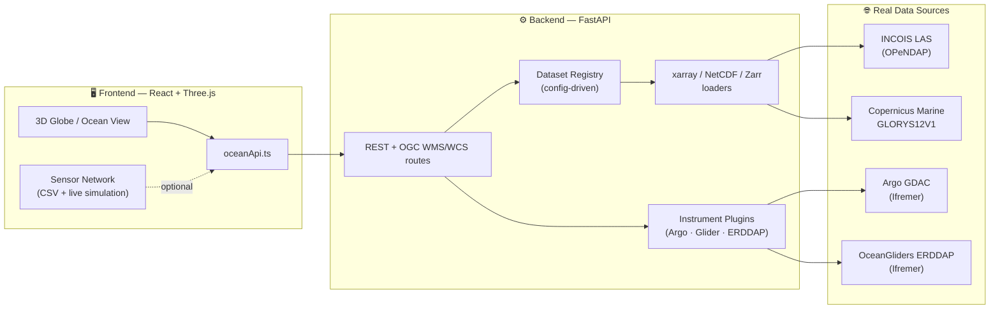

<div align="center">
# 🌊 INCOIS 3D-VDAS — Global Earth
 
**A real-time 3D ocean data visualization & telemetry architecture system**
 
*Interactive globe · live in-situ sensor networks · gridded ocean model fields · early-warning intelligence*
 
[](https://react.dev)
[](https://www.typescriptlang.org/)
[](https://threejs.org/)
[](https://vitejs.dev/)
[](https://fastapi.tiangolo.com/)
[](https://www.python.org/)
[](#license)
 
</div>
---
 
## 🌐 What is this?
 
**INCOIS 3D-VDAS** ("Visualization & Data Architecture System") is a browser-native
platform for exploring the Indian Ocean in three dimensions — a real, rotating
globe you can fly around, populated with live-drifting Argo floats and gliders,
draped with real gridded ocean model fields (temperature, salinity, currents,
chlorophyll), and backed by a modular Python service that speaks the actual
protocols oceanographers use (NetCDF, Zarr, OPeNDAP, ERDDAP, OGC WMS/WCS).
 
Built for the kind of operational picture INCOIS (Indian National Centre for
Ocean Information Services) needs: one screen, the whole basin, live.
 
<div align="center">
*( screenshot / demo GIF goes here — drop one in `docs/preview.gif` and reference it )*
 
</div>
---
 
## ✨ Features
 
| | |
|---|---|
| 🌍 **Interactive 3D Globe** | Fly-around satellite globe with real bathymetry, basin selection, and day/night terminator |
| 🛟 **Live Sensor Network** | Argo floats, gliders, moored buoys (OMNI/RAMA), bottom-pressure recorders, and drifters — with continuous, physically-plausible drift and value simulation |
| 🌊 **Volumetric Ocean View** | Depth-sliced 3D water column with real-time draped model textures, current-flow ribbons, and bathymetric terrain |
| 📡 **Live Model Data** | Temperature, salinity, currents, and chlorophyll fields pulled from a real backend, with graceful procedural fallback when a source isn't cached |
| 🚨 **Early Warning Intelligence** | Regional marine/hazard news feed (tsunami, seismic, cyclone) via GNews, alongside simulated advisory alerts |
| 🎧 **Acoustic Monitoring** | Real-time acoustic spectrogram view for underwater telemetry/tomography |
| 🧭 **Target Basin Matrix** | At-a-glance SST, salinity, wave height, and flow velocity across the Bay of Bengal, Arabian Sea, and full Indian Ocean |
| 🔌 **Config-Driven Backend** | New data sources, variables, and color scales register via YAML — no route code changes needed |
| 🧩 **Plugin System** | Instrument sources (Argo, gliders, ERDDAP-backed moorings/CTD) share one generic discovery/profile/trajectory API |
| 🗺️ **OGC Standards** | WMS 1.3.0 and WCS 2.0.1 endpoints, so any GIS client (QGIS, ArcGIS) can consume the same model data |
 
---
 
## 🏗️ Architecture
 

 
**Design principle:** the frontend never hardcodes where data comes from —
`oceanApi.ts` calls a stable REST surface, and the backend's `config/*.yaml`
registries decide which real source answers each request, with local caches
preferred over live network calls and honest, typed error responses when
neither is available.
 
---
 
## 📁 Project Structure
 
```
incois-3d-vdas---global-earth/
├── src/                          Frontend (React + TypeScript + Three.js)
│   ├── components/               Globe, ocean, sensor, and dashboard views
│   │   └── ocean3d/               Bathymetric terrain, probe models, seafloor ecosystem
│   ├── data/                     Static basin/probe datasets (CSV-backed)
│   ├── services/oceanApi.ts      Typed backend API client
│   └── App.tsx                   Navigation, live-simulation loop, backend status
│
├── backend/                      FastAPI service
│   ├── app/
│   │   ├── api/                  REST routes + OGC WMS/WCS
│   │   ├── services/             NetCDF/Zarr/OPeNDAP/ERDDAP loaders, dataset registry
│   │   ├── plugins/               Argo / Glider / ERDDAP instrument plugins
│   │   └── core/plugins.py        Plugin registry framework
│   ├── scripts/                  Data ingestion scripts (one per source)
│   └── tests/
│
├── config/                       YAML registries (data sources, variables, color scales, domain)
├── data/                         Local cache populated by ingestion scripts (gitignored)
└── BACKEND_SETUP.md              Backend-specific setup notes
```
 
---
 
## 🚀 Getting Started
 
### Prerequisites
- **Node.js** 20+
- **Python** 3.11+
### 1. Clone & install the frontend
 
```bash
git clone https://github.com/<your-username>/<your-repo>.git
cd incois-3d-vdas---global-earth
npm install
```
 
### 2. Set up the backend
 
```bash
cd backend
python -m venv .venv
 
# Windows
.venv\Scripts\activate
# macOS/Linux
source .venv/bin/activate
 
pip install --no-cache-dir -r requirements.txt
uvicorn app.main:app --reload --port 8000
```
 
### 3. Run the frontend (new terminal, back in project root)
 
```bash
npm run dev
```
 
Open **http://localhost:3000** — the header's backend status indicator
should read **online** once both are running. `vite.config.ts` already
proxies `/api/*` to `http://localhost:8000`.
 
> 📘 See **[BACKEND_SETUP.md](./BACKEND_SETUP.md)** for data ingestion,
> the optional Copernicus Marine setup, and troubleshooting.
 
---
 
## 🔌 API Overview
 
Full interactive docs at `http://localhost:8000/api/docs` once running.
 
| Endpoint | Description |
|---|---|
| `GET /api/v1/model/sources` | Registered gridded model sources |
| `GET /api/v1/model/variables` | Canonical variables, units, default color scales |
| `GET /api/v1/model/slice` | Horizontal depth-slice grid (map layer) |
| `GET /api/v1/model/volume` | Stacked depth slices (3D volumetric rendering) |
| `GET /api/v1/model/section` | Depth-vs-distance vertical transect |
| `GET /api/v1/model/isosurface` | Triangulated isosurface mesh (marching cubes) |
| `GET /api/v1/argo/floats` | Argo floats active in a region/time window |
| `GET /api/v1/argo/profile/{id}` | Depth-vs-variable profile for one float |
| `GET /api/v1/glider/deployments` | Glider deployments in a region |
| `GET /api/v1/insitu/plugins` | Every registered instrument source, generically |
| `GET /api/v1/ogc/wms` | OGC WMS 1.3.0 (GetCapabilities / GetMap / GetLegendGraphic) |
| `GET /api/v1/ogc/wcs` | OGC WCS 2.0.1 (GetCapabilities / DescribeCoverage / GetCoverage) |
 
---
 
## 🧭 Roadmap / Known Limitations
 
- Copernicus Marine GLORYS12V1 requires a free account and local ingestion —
  without it, model-field views gracefully fall back to procedural visuals
  (this is by design, not a bug).
- Argo/glider sensor markers currently use a bundled CSV dataset with
  built-in motion simulation rather than the live backend feed — wiring
  these to `oceanApi.listArgoFloats()` / `listGliderDeployments()` is a
  natural next step.
- Satellite tracks, acoustic tomography, and some early-warning alerts are
  currently simulated for demonstration — no live telemetry source is
  wired for these yet.
Contributions welcome — see [Contributing](#contributing) below.
 
---
 
## 🤝 Contributing
 
1. Fork the repo and create a feature branch
2. Keep frontend and backend changes in separate commits where possible
3. Run `pytest backend/tests/` and `npm run build` before opening a PR
4. Open a PR describing what you changed and why
---
 
## 📄 License
 
Distributed under the MIT License. See `LICENSE` for details.
 
---
 
<div align="center">
**Built for operational oceanography.** 🌊
 
*Indian National Centre for Ocean Information Services (INCOIS)*
 
</div>
 
